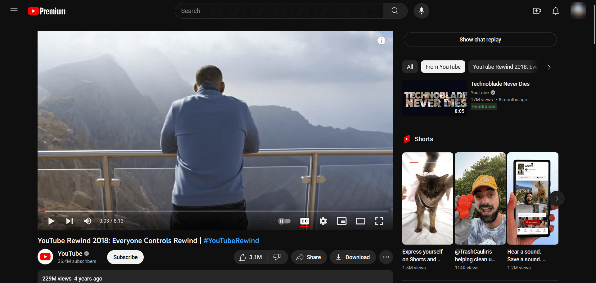
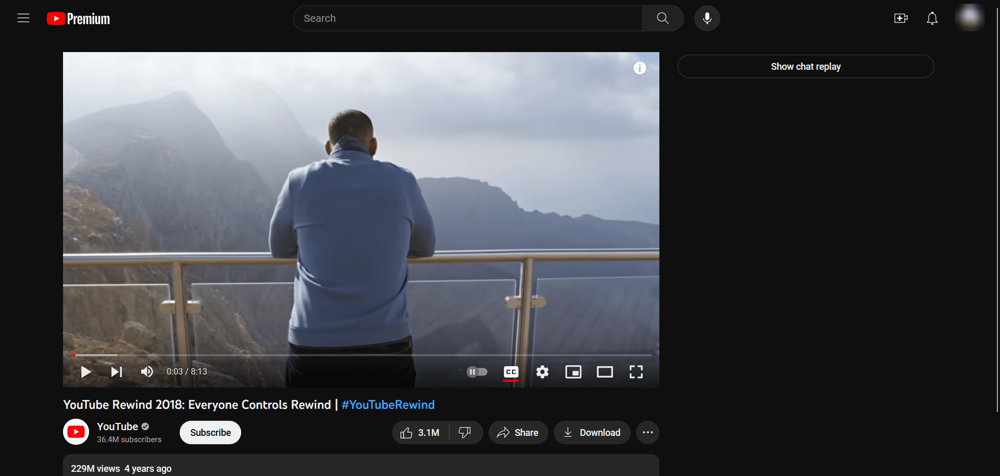

# Userstyles

My userstyles collection.

## Extentions

You need an extention to use these:

* Stylus
  * [Chrome and Chromium-based](https://chrome.google.com/webstore/detail/stylus/clngdbkpkpeebahjckkjfobafhncgmne)
  * [Firefox](https://addons.mozilla.org/firefox/addon/styl-us/)

## Styles

Also available at [Install from UserStyles.world](https://userstyles.world/user/birdie0).

| Website | Install from GitHub | Install from UserStyles.world |
| --- | --- | --- |
| `dev.to` | [![Install from GitHub]](https://raw.githubusercontent.com/Birdie0/userstyles/master/styles/dev.to.user.css) | [![Install from UserStyles.world]](https://userstyles.world/style/636/comic-dev-to) |
| `fandom.com` | [![Install from GitHub]](https://raw.githubusercontent.com/Birdie0/userstyles/master/styles/fandom.com.user.css) | [![Install from UserStyles.world]](https://userstyles.world/style/624/cleaner-fandom-com) |
| `google.com` | [![Install from GitHub]](https://raw.githubusercontent.com/Birdie0/userstyles/master/styles/google.com.user.css) | [![Install from UserStyles.world]](https://userstyles.world/style/635/better-google-com) |
| `mynoise.net` | [![Install from GitHub]](https://raw.githubusercontent.com/Birdie0/userstyles/master/styles/mynoise.net.user.css) | - |
| `stackoverflow.com` | [![Install from GitHub]](https://raw.githubusercontent.com/Birdie0/userstyles/master/styles/stackoverflow.com.user.css) | [![Install from UserStyles.world]](https://userstyles.world/style/637/comic-stackoverflow-com) |
| `mail.google.com` | [![Install from GitHub]](https://raw.githubusercontent.com/Birdie0/userstyles/master/styles/mail.google.com.user.css) | [![Install from UserStyles.world]](https://userstyles.world/style/7448/better-gmail-com) |
| `twitter.com` | [![Install from GitHub]](https://raw.githubusercontent.com/Birdie0/userstyles/master/styles/twitter.com.user.css) | [![Install from UserStyles.world]](https://userstyles.world/style/7449/cleaner-twitter-com) |
| `youtube.com` | [![Install from GitHub]](https://raw.githubusercontent.com/Birdie0/userstyles/master/styles/youtube.com.user.css) | [![Install from UserStyles.world]](https://userstyles.world/style/11062/less-distraction-youtube) |

## Gallery

  
Dev

  | before | after |
  | --- | --- |
  |  |  |

  
Fandom

  | before | after |
  | --- | --- |
  |  |  |

  
Google

  | before | after |
  | --- | --- |
  |  |  |

  
MyNoise

  | before | after |
  | --- | --- |
  | - | disabled parallax effect |

  
StackOverflow

  | before | after |
  | --- | --- |
  |  |  |

  
Gmail

  | before | after |
  | --- | --- |
  |  |  |

  
Twitter

  | before | after |
  | --- | --- |
  |  |  |

  
YouTube

  | before | after |
  | --- | --- |
  |  |  |

## P.S

StackOverflow and Dev userstyles use drop-in replacement font [Fantasque Sans Mono](https://github.com/belluzj/fantasque-sans). Install it for the best experience.

[Install from GitHub]: https://img.shields.io/badge/Install-333?logo=github
[Install from UserStyles.world]: https://img.shields.io/badge/Install-242424?logo=data:image/svg%2bxml;base64,PHN2ZyB4bWxucz0iaHR0cDovL3d3dy53My5vcmcvMjAwMC9zdmciIHZpZXdCb3g9IjAgMCA1MTIgNTEyIj48ZyBzdHlsZT0ic3Ryb2tlOiMwMDA7c3Ryb2tlLXdpZHRoOjg7c3Ryb2tlLWxpbmVjYXA6cm91bmQ7c3Ryb2tlLWxpbmVqb2luOnJvdW5kIj48cGF0aCBmaWxsPSIjMDBmNmViIiBkPSJNOTUgOTBhNTUgNTAgMCAxIDAtNTAgODd6bTM3MyA3OGE1NSA1MCAwIDEgMC01Mi04NXoiLz48cGF0aCBmaWxsPSIjMDBmNmViIiBkPSJNNDc1IDQ2M1YxODBhMyAyIDAgMCAwLTQzNSAwdjI4M3oiLz48cGF0aCBmaWxsPSIjRkZGIiBkPSJNMTcwIDg0YTI3IDI2IDAgMCAwIDAgMTMwIDI3IDI2IDAgMCAwIDAtMTMwbTE3MC05YTI3IDI2IDAgMCAwIDAgMTMwIDI3IDI2IDAgMCAwIDAtMTMwTTIzMCAyNDVsLTEgMzdhMSAxIDAgMCAwIDMxIDUgMSAxIDAgMCAwIDMwLTVsLTEtMzd6bTMwIDQydi00MiIvPjxwYXRoIGZpbGw9IiNlZWNjOGEiIGQ9Ik0zNzMgMzk3YTIgOSA0MCAwIDAgOTUtMTA5IDIgOSA0MCAwIDAtOTUgMTA5Ii8+PHBhdGggZmlsbD0iIzQ1YjU1OSIgZD0ibTMzMCA0MjQgNS0xYTEyIDEyIDAgMCAwIDktMTEgMTkgMTkgMCAxIDEgMzQgMTMgMjkgMjkgMCAwIDEtNDUgNHoiLz48cGF0aCBmaWxsPSIjZTA3NjBhIiBkPSJNODAgMzM4YzE2IDIgMzUgNyA0NCAxM3M4IDIyIDIgMzAtMTUgOC0yNCAzbC0yMi0xNnptMzU4IDI3cy0zMyA2LTQ0IDEyLTkgMjEtMyAzMCAxNSA3IDI1IDQgMTYtMTAgMjItMTd6TTMxMyAyMzVhMiAxIDAgMCAwLTExMSAwIDUgMiAwIDAgMCAxMTEgMCIvPjwvZz48cGF0aCBkPSJNMjU3IDE4NmExMiA3IDAgMCAwIDAgMzYgMTIgNyAwIDAgMCAwLTM2bS0xMTktNDJhMSAxIDAgMCAwIDAgNDQgMSAxIDAgMCAwIDAtNDRtMTc2LTNhMSAxIDAgMCAwIDAgNDQgMSAxIDAgMCAwIDAtNDQiLz48L3N2Zz4=
