# Userstyles

My userstyles collection.

## Extentions

You need an extention to use these:

* Stylus
  * [Chrome](https://chrome.google.com/webstore/detail/stylus/clngdbkpkpeebahjckkjfobafhncgmne)
  * [Firefox](https://addons.mozilla.org/firefox/addon/styl-us/)
  * [Opera](https://github.com/openstyles/stylus/wiki/Opera,-Outdated-Stylus)

## Styles

* dev.to - 
* fandom.com - 
* google.com - 
* mynoise.net - 
* stackoverflow.com - 
* mail.google.com - 
* twitter.com - 

## Gallery

  
Dev

  |before|after|
  |---|---|
  ||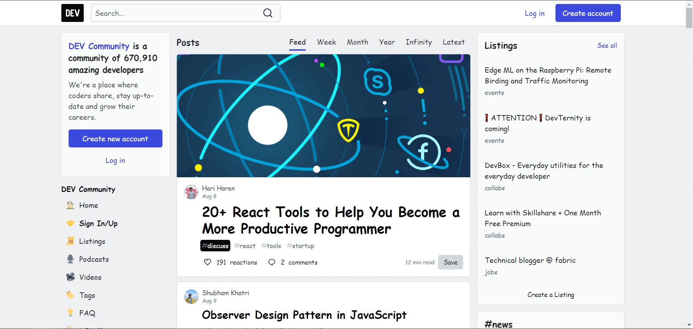|

  
Fandom

  |before|after|
  |---|---|
  |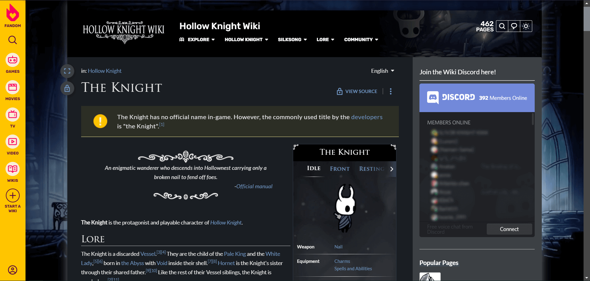|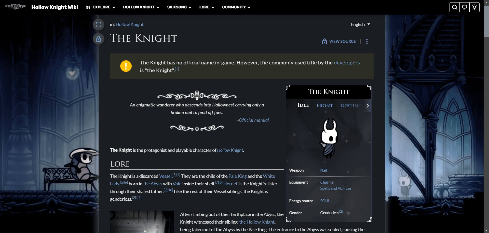|

  
Google

  |before|after|
  |---|---|
  |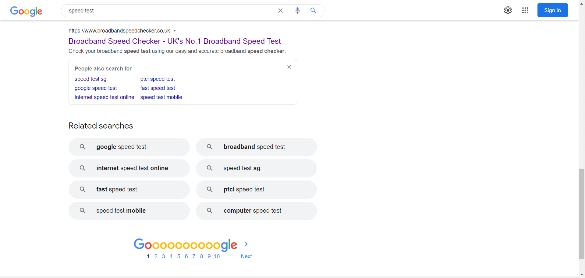|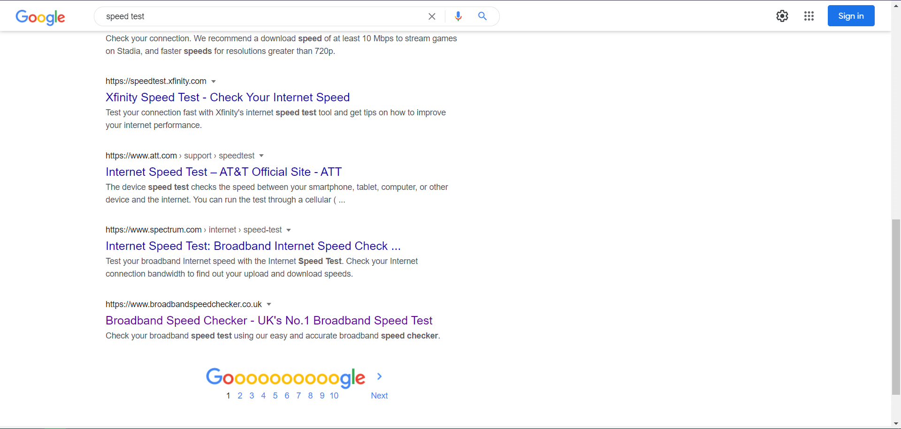|

  
MyNoise

  |before|after|
  |---|---|
  |-|disabled parallax effect|

  
StackOverflow

  |before|after|
  |---|---|
  |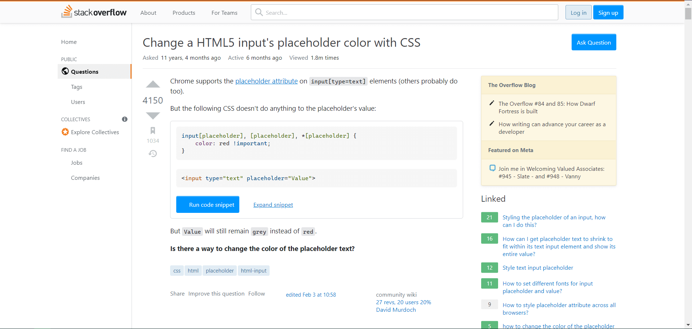|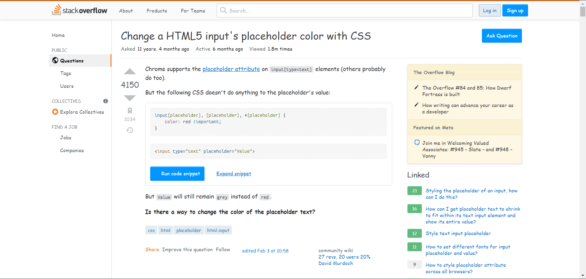|

  
Gmail

  |before|after|
  |---|---|
  |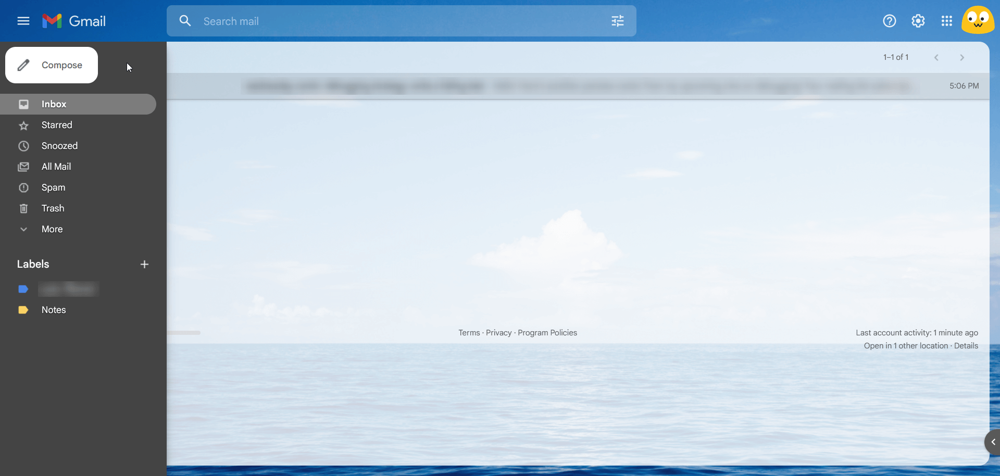|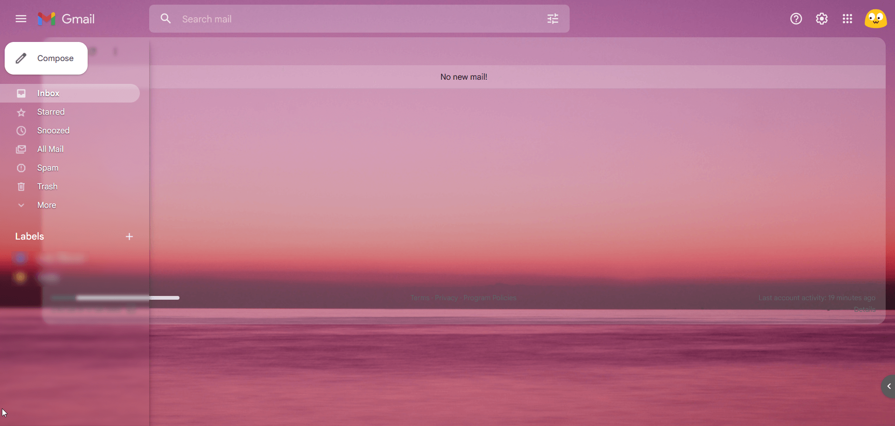|

  
Twitter

  |before|after|
  |---|---|
  |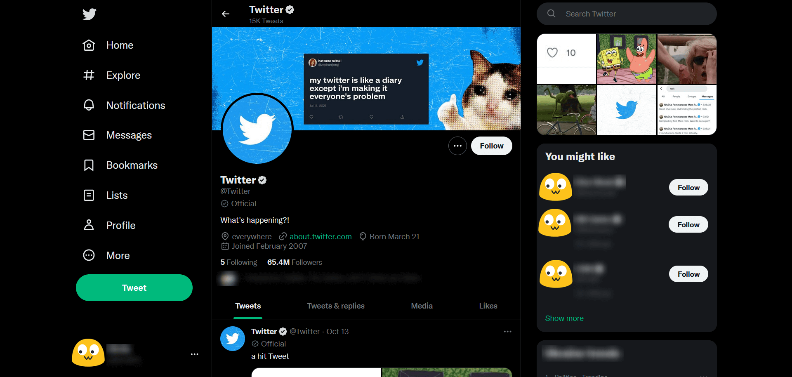|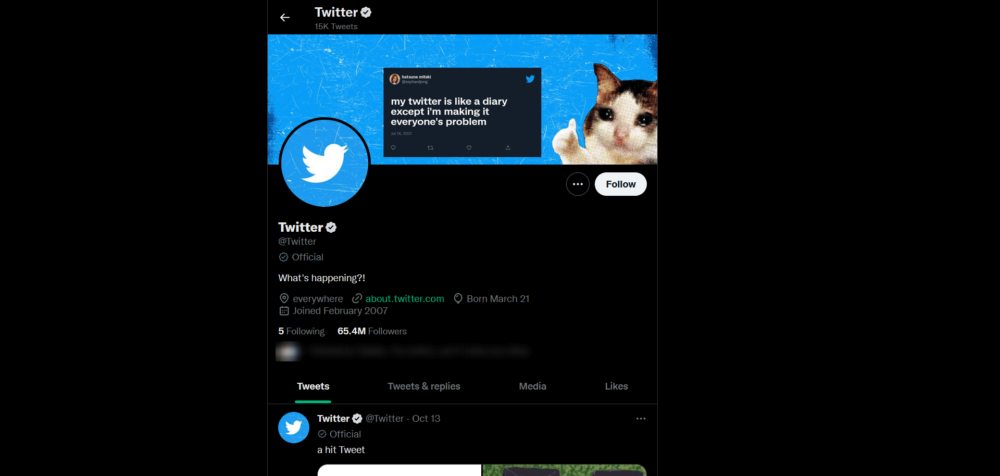|

## P.S.

StackOverflow and Dev userstyles use drop-in replacement font [Fantasque Sans Mono](https://github.com/belluzj/fantasque-sans). Install it for the best experience.
